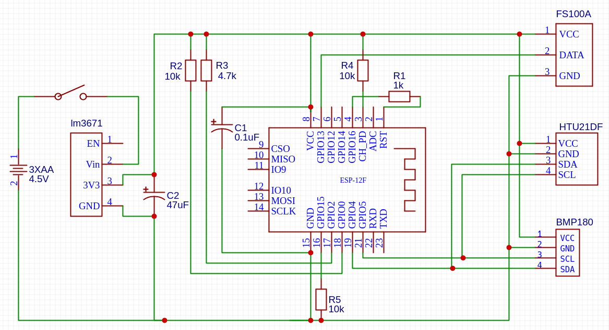

# ESP8266 Weather-Station

A simple battery powered Weather-Station using the ESP8266.

Transmits the current temperature periodically via 433MHz (range: ~5meters).  
Uses the same encoding as the 'LaCrosse TX2U Temperature Sensor'.

Publishes the temperature, humidity and pressure to OpenWeatherMap.org.  
Data is buffered in the RTC memory and published once per hour to preserve battery.

## Hardware

### Components

* ESP-12F ESP8266 Module
* LM3671 3.3V Buck Converter Breakout
* Adafruit HTU21D-F Temperature & Humidity Sensor
* BMP180 BOSCH Temperature Pressure Sensor 
* FS1000A 433MHz Transmitter

### Schematics




## Configuration
### secrets.h

```C++
#define SECRET_WIFI_SSID        "wifi_ssid"
#define SECRET_WIFI_PASSWD      "wifi_password"
#define SECRET_OWM_API_KEY      "open_weather_map_api_key"
#define SECRET_OWM_STATION_ID   "open_weather_map_station_id"
```


## Installation

### Arduino IDE Settings


#### Libaries
* Adafruit BMP085 Unified
* Adafruit HTU21DF Library
* NTPClient

#### Board
Additional Boards Manager URLS: http://arduino.esp8266.com/stable/package_esp8266com_index.json

* Board: Generic ESP8266 Module
* Flash Mode: DIO
* Flash Size: "1MB (FS: 512KB OTA: ~246KB)"

### Programmer Wiring
| Programmer  | ESP12 |
| ---- | --- |
| 3V3  | VCC |
| GND  | GND |
| TXD  | RXD |
| RXD  | TXD |
| GND  | GPIO0 (only when uploading) |